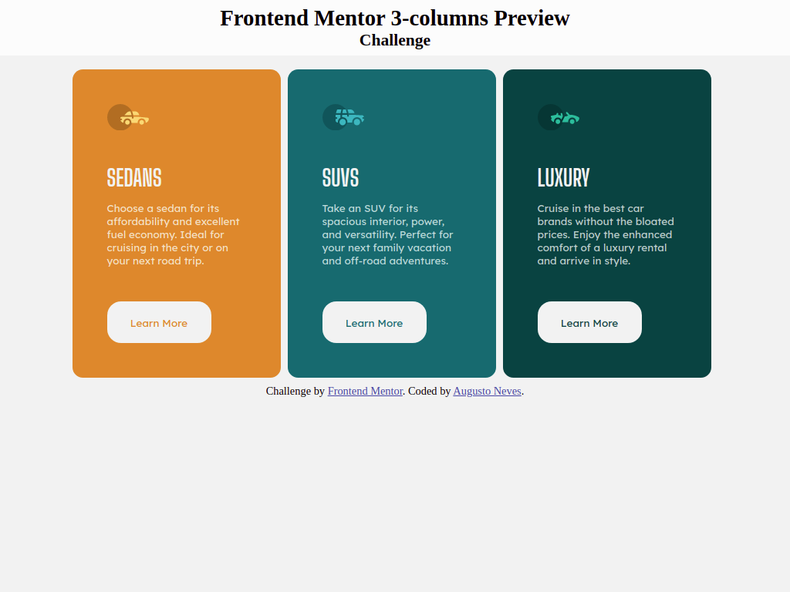

# Frontend Mentor - 3-column preview card component solution

This is a solution to the [3-column preview card component challenge on Frontend Mentor](https://www.frontendmentor.io/challenges/3column-preview-card-component-pH92eAR2-). Frontend Mentor challenges help me to improve my coding skills by building realistic projects. 

## Table of contents

- [Overview](#overview)
  - [The challenge](#the-challenge)
  - [Screenshot](#screenshot)
  - [Links](#links)
- [My process](#my-process)
  - [Built with](#built-with)
  - [What I learned](#what-i-learned)
  - [Continued development](#continued-development)
  - [Useful resources](#useful-resources)
- [Author](#author)

## Overview

### The challenge

Users should be able to:

- View the optimal layout depending on their device's screen size
- See hover states for interactive elements

### Screenshot

### Links

- Solution URL: [Add solution URL here](https://your-solution-url.com)
- Live Site URL: [Add live site URL here](https://your-live-site-url.com)

## My process

### Built with

- Semantic HTML5 markup
- CSS custom properties
- Flexbox
- SCSS

### What I learned

I had a chance to practice my Flexbox Layout skills by taking this challenge. I was able to use the CSS properties of the flexbox layout as a flex-wrap to build a responsive card without media queries just using flexbox.

### Continued development

I want to learn and use more SCSS and yours properties. SCSS is a greatfull tool to build Cascading Style Sheets faster.

### Useful resources

- [MDN Flexbox Reference - Portuguese-BR](https://developer.mozilla.org/pt-BR/docs/Learn/CSS/CSS_layout/Flexbox) - This helped me with the concepts of flexbox layout. I really liked this pattern and will use it more.
- [Flexbox Complete Guide - Portuguese-BR](https://www.example.com) - This article helped me to understand every propriety of Flexbox Layout. I'd recommend it to anyone still learning this concept.

## Author

- GitHub's Repositories - [Augusto Neves](https://github.com/Augusto-Neves)
- Frontend Mentor - [@yourusername](https://www.frontendmentor.io/profile/Augusto-Neves)
- Instagram - [@yourusername](https://www.twitter.com/yourusername)
